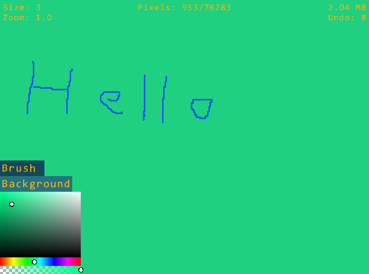

# What's up?
This a program for sketching and laying out your thoughts.
It excels at scribbling garbage on an infinite canvas.

# Limits
You draw pixels/particles and eventually you will draw to much in which case
the program will slow down. I would recommend small zoom and high brush size.
At the very least high brush size with high zoom.

# Features
- Color picker
- Resizing brush (scroll wheel)
- Undo (CTRL+Z), redo (CTRL+R)
- Panning or moving the canvas (middle mouse button)
- Zoom (CTRL + scroll wheel OR right mouse button + scroll wheel)
- Save and load drawings (CTRL+SHIFT+S, CTRL+L)
- Export png (CTRL+E)
- Clear canvas (CTRL+SHIFT+N, no prompt appears)

# Building the project (only on windows with vcvars64.bat)
First you need to have Visual Studio installed.
Then you need to find vcvars64.bat which is usually located in:
`C:\Program Files\Microsoft Visual Studio\2022\Community\VC\Auxiliary\Build\vcvars64.bat`
VCVARS in build.bat should point to your version of vcvars64.bat.

Running build.bat will compile the project with debug options.
There is currently no release configuration yet.
Once compiled you will find the executable in the bin folder.

**Note:** vcvars64.bat is used to setup environment variables for
Microsoft Visual C++ compiler. The build.bat script can then use 
cl and link to compile and link the project.

# What libraries do I use?
Engone, GLFW, GLEW and ReactPhysics3D.
- Engone is a library I have made for another project (ProjectUnknown).
- GLFW is a library for handling windows and input.
- GLEW is a wrapper for OpenGL.
- ReactPhysics3D isn't used but Engone requires it.